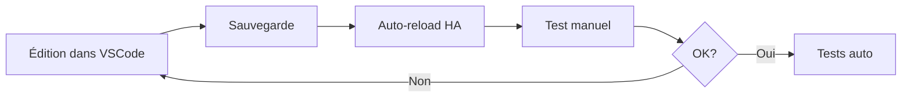
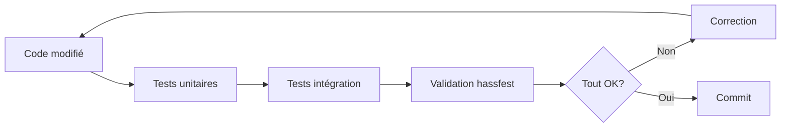
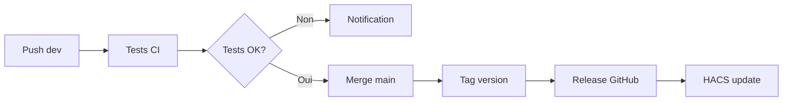

# Haptique RS90 - Environnement de Développement

## 🏗️ Architecture proposée

```
haptique_rs90/
├── custom_components/haptique_rs90/     # Code de l'intégration
├── tests/                                # Tests automatisés
│   ├── unit/                            # Tests unitaires
│   ├── integration/                     # Tests d'intégration
│   └── fixtures/                        # Données de test
├── scripts/                              # Scripts utilitaires
│   ├── deploy.sh                        # Déploiement
│   ├── test.sh                          # Lancement tests
│   └── validate.sh                      # Validation pre-commit
├── .github/
│   └── workflows/
│       ├── tests.yml                    # Tests auto sur PR
│       ├── release.yml                  # Release automatique
│       └── hassfest.yml                 # Validation HA
├── .vscode/                              # Config VSCode
│   ├── settings.json
│   ├── launch.json                      # Debug config
│   └── tasks.json                       # Tasks automatiques
├── dev/                                  # Environnement dev
│   ├── docker-compose.yml               # HA de test
│   └── configuration.yaml               # Config test
├── pytest.ini                            # Config pytest
├── requirements_test.txt                # Dépendances tests
└── README_DEV.md                        # Guide développeur
```

---

## 🚀 Workflow de développement

### 1. Développement local (VSCode Server)



### 2. Tests automatisés



### 3. Déploiement



---

## 🛠️ Outils à mettre en place

### Tests automatisés
- ✅ **pytest** - Framework de test
- ✅ **pytest-homeassistant-custom-component** - Helper HA
- ✅ **pytest-cov** - Couverture de code
- ✅ **pytest-asyncio** - Tests async

### Validation
- ✅ **hassfest** - Validation officielle HA
- ✅ **black** - Formatage code Python
- ✅ **flake8** - Linting
- ✅ **mypy** - Type checking

### CI/CD
- ✅ **GitHub Actions** - Automatisation
- ✅ **Dependabot** - Mise à jour dépendances

### Debug
- ✅ **VSCode debugger** - Debug dans HA
- ✅ **pytest --pdb** - Debug tests

---

## 📦 Composants à créer

### 1. Tests unitaires
```python
tests/unit/
├── test_config_flow.py      # Tests config flow
├── test_coordinator.py       # Tests coordinator
├── test_sensor.py            # Tests sensors
├── test_switch.py            # Tests switches
└── test_services.py          # Tests services
```

### 2. Tests d'intégration
```python
tests/integration/
├── test_mqtt_communication.py  # Tests MQTT
├── test_entity_updates.py      # Tests entités
└── test_rename_handling.py     # Tests renommage
```

### 3. Fixtures
```python
tests/fixtures/
├── mqtt_messages.json        # Messages MQTT de test
├── config_entries.json       # Configurations test
└── mock_data.py              # Données mockées
```

---

## 🔧 Scripts utilitaires

### deploy.sh
- Copie vers HA de dev
- Redémarre HA
- Vérifie les logs

### test.sh
- Lance tous les tests
- Génère rapport de couverture
- Vérifie le formatage

### validate.sh
- Exécute hassfest
- Vérifie les types
- Valide manifest.json

---

## 🐛 Configuration Debug VSCode

Permet de :
- Mettre des breakpoints
- Inspecter les variables
- Suivre l'exécution pas à pas
- Debug directement dans HA

---

## 📊 Métriques de qualité

- ✅ Couverture de code > 80%
- ✅ Tous les tests passent
- ✅ Pas d'erreur de linting
- ✅ Type hints corrects
- ✅ Validation hassfest OK

---

## 🎯 Prochaines étapes

1. Créer structure de tests
2. Écrire tests de base
3. Configurer CI/CD
4. Setup debug VSCode
5. Documentation développeur
