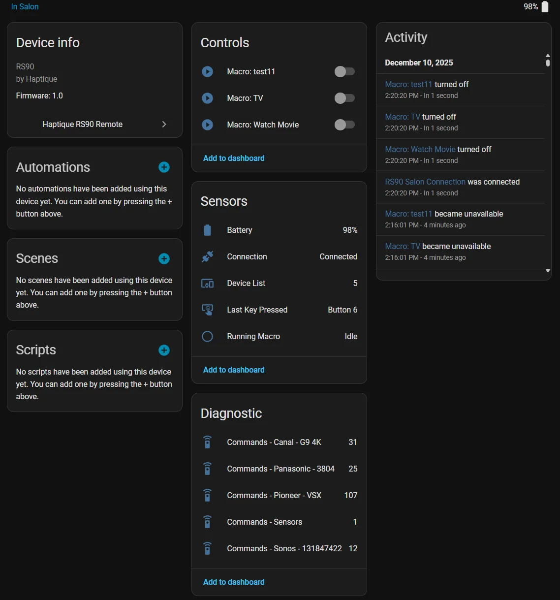
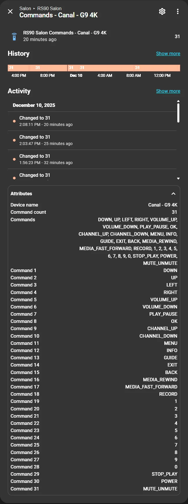

# Haptique RS90 - Home Assistant Integration

[](https://github.com/daangel27/haptique_rs90/releases)
[](https://github.com/hacs/integration)
[](LICENSE)

Home Assistant integration for the **Haptique RS90** universal remote via MQTT.

**English** | [Français](README_FR.md)

---

## 📸 Screenshots

<table>
<tr>
<td width="30%">

<p align="center"><em>Device Information & Controls</em></p>
</td>
<td width="30%">

<p align="center"><em>Device List</em></p>
</td>
<td width="50%">

<p align="center"><em>Device Commands List</em></p>
</td>
</tr>
</table>

---

## ✨ Features

- 🎛️ **Macro switches**: Control your macros with visible ON/OFF state
- 🔋 **Battery sensor**: Monitor remote battery level  
- 🔌 **Connection status**: Real-time online/offline detection
- 🎮 **Key detection**: Last pressed key sensor
- 📱 **Device list**: View all configured devices
- 📋 **Device commands**: Sensors showing available commands for each device
- 🔄 **100% MQTT-driven**: No polling, pure event-driven updates
- 🎯 **QoS optimized**: QoS 0 for monitoring, QoS 1 for control commands
- 🚀 **Auto-discovery**: Automatic Remote ID detection
- 🌍 **Multi-language**: English and French

## 📋 Requirements

- Home Assistant 2024.1.0 or higher
- **Configured MQTT broker** (Mosquitto recommended)
- **Haptique RS90 remote configured and connected to MQTT**

## 🚀 Installation

### Via HACS (Recommended)

1. Open HACS in Home Assistant
2. Click on "Integrations"
3. Click the three dots in the top right
4. Select "Custom repositories"
5. Add URL: `https://github.com/daangel27/haptique_rs90`
6. Category: `Integration`
7. Click "Add"
8. Search for "Haptique RS90"
9. Click "Download"
10. Restart Home Assistant

### Manual Installation

1. Download the latest version from [Releases](https://github.com/daangel27/haptique_rs90/releases)
2. Extract contents to `/config/custom_components/haptique_rs90/`
3. Restart Home Assistant

## ⚙️ Configuration

### Prerequisites

Before adding the integration, make sure:
1. ✅ **MQTT broker is configured** in Home Assistant
2. ✅ **RS90 is configured** to connect to your MQTT broker (via Haptique Config app)
3. ✅ **RS90 is online** and publishing to MQTT

### Auto-discovery

Once the prerequisites are met:

1. Go to **Settings** → **Devices & Services**
2. Click **Add Integration**
3. Search for **Haptique RS90**
4. **The integration will automatically discover your remote** 🎉
5. Give it a name (optional, default: "RS90 {ID}")
6. Click **Submit**

That's it! The integration will automatically create all entities.

### MQTT Topics

The integration subscribes to these topics (all with retained messages):

```
Haptique/{RemoteID}/status                    # Online/offline status
Haptique/{RemoteID}/battery_level             # Battery level (0-100)
Haptique/{RemoteID}/keys                      # Pressed keys
Haptique/{RemoteID}/macro/list                # Macro list (JSON)
Haptique/{RemoteID}/device/list               # Device list (JSON)
Haptique/{RemoteID}/device/{device}/commands  # Device commands (JSON)
Haptique/{RemoteID}/macro/{name}/trigger      # Macro state (on/off)
```

## 📊 Created Entities

### Sensors

| Entity | Description | Values |
|--------|-------------|---------|
| `sensor.{name}_battery` | Battery level | 0-100% |
| `sensor.{name}_last_key_pressed` | Last pressed key | Key name |
| `sensor.{name}_running_macro` | Running macro | Macro name or "Idle" |
| `sensor.{name}_device_list` | Device list | Number of devices |
| `sensor.commands_{device}` | Available commands | Command list (diagnostic) |

### Binary Sensors

| Entity | Description | States |
|--------|-------------|-------|
| `binary_sensor.{name}_connection` | Connection status | ON (online) / OFF (offline) |

### Switches

| Entity | Description | Actions |
|--------|-------------|---------|
| `switch.macro_{macro_name}` | Macro control | ON / OFF / TOGGLE |

**Switch features:**
- ✅ Visible state (ON = macro active, OFF = macro inactive)
- ✅ Native toggle
- ✅ Dynamic icon (▶️ / ⏹️)
- ✅ Blue (ON) / Gray (OFF) coloring

## 🎯 Usage Examples

### Dashboard

```yaml
type: entities
title: Living Room Remote
entities:
  - entity: binary_sensor.rs90_connection
    name: Connection
  - entity: sensor.rs90_battery
    name: Battery
  - entity: switch.macro_watch_tv
    name: Watch TV
  - entity: switch.macro_cinema_mode
    name: Cinema Mode
```

### Automation

```yaml
automation:
  - alias: "Auto TV on arrival"
    trigger:
      - platform: state
        entity_id: person.me
        to: "home"
    condition:
      - condition: state
        entity_id: binary_sensor.rs90_connection
        state: "on"
      - condition: state
        entity_id: switch.macro_watch_tv
        state: "off"
    action:
      - service: switch.turn_on
        target:
          entity_id: switch.macro_watch_tv
```

### Script

```yaml
script:
  cinema_scene:
    alias: "Cinema Scene"
    sequence:
      - service: switch.turn_on
        target:
          entity_id: switch.macro_cinema_mode
      - service: light.turn_off
        target:
          entity_id: light.living_room
      - delay:
          seconds: 2
      - service: media_player.play_media
        target:
          entity_id: media_player.tv
```

## 🔧 Available Services

### `haptique_rs90.trigger_macro`

Manually trigger a macro.

```yaml
service: haptique_rs90.trigger_macro
data:
  rs90_id: "6f99751e78b5a07de72d549143e2975c"  # Your RS90 device ID
  rs90_macro_id: "692eb1561bddd5814022960c"  # Find in sensor.macro_{name}_info attributes
  action: "on"
```

### `haptique_rs90.trigger_device_command`

Send a command to a device.

```yaml
service: haptique_rs90.trigger_device_command
data:
  rs90_id: "6f99751e78b5a07de72d549143e2975c"  # Your RS90 device ID
  rs90_device_id: "692ead781bddd58140228e33"  # Find in sensor.{remote}_commands_{device} attributes
  command_name: "POWER"
```

**Tip:** Use the `sensor.{remote_name}_commands_{device}` entity to see available commands and get the `rs90_device_id` from attributes.

---

## 🎨 Dashboard Templates

Want beautiful remote control cards? Check out our **dashboard templates**!

### Device Buttons Card Template

Automatically generate a complete remote control card with all commands:

<table>
<tr>
<td width="60%">

</td>
<td width="40%">
<p><strong>Features:</strong></p>
<ul>
<li>✅ Auto-generated buttons</li>
<li>✅ 3D styling with card-mod</li>
<li>✅ Responsive grid layout</li>
<li>✅ Works with any device</li>
</ul>
<p><strong><a href="templates/">📖 View Templates →</a></strong></p>
</td>
</tr>
</table>

---

## 🛠️ Troubleshooting

### Remote not detected

1. Verify **MQTT broker is configured** in Home Assistant (Settings > Devices & Services > MQTT)
2. Check that **RS90 is configured** to connect to MQTT (Haptique Config app)
3. Verify **RS90 is online** (check in Haptique Config app)
4. Use **MQTT Explorer** to verify messages are published
5. Enable debug logs:

```yaml
logger:
  logs:
    custom_components.haptique_rs90: debug
```

### Switches don't reflect correct state

1. Verify the macro is properly configured in RS90
2. Check MQTT Explorer for `macro/{name}/trigger` topics
3. Restart Home Assistant

### Battery always shows 0

The battery level is updated on demand. Trigger an update manually or wait for the next automatic update.

## 📁 File Structure

```
custom_components/haptique_rs90/
├── __init__.py           # Integration entry point
├── manifest.json         # Integration metadata
├── config_flow.py        # Configuration interface
├── coordinator.py        # MQTT coordinator
├── const.py              # Constants
├── sensor.py             # Sensors
├── binary_sensor.py      # Binary sensors
├── switch.py             # Macro switches
├── services.yaml         # Service definitions
├── strings.json          # English translations
├── icon.png              # Integration icon
└── translations/
    ├── en.json           # English translations
    └── fr.json           # French translations
```

## 🤝 Contributing

Contributions are welcome! Feel free to:

1. Fork the project
2. Create a branch (`git checkout -b feature/improvement`)
3. Commit your changes (`git commit -m 'Add feature'`)
4. Push to branch (`git push origin feature/improvement`)
5. Open a Pull Request

## 📄 License

This project is licensed under the MIT License. See [LICENSE](LICENSE) file for details.

## 🙏 Acknowledgments

- [Cantata Communication Solutions](https://github.com/Cantata-Communication-Solutions) for creating the **Haptique RS90** remote
- Home Assistant team for the excellent platform
- Haptique community for support

## 📞 Support

- 🐛 [Report a bug](https://github.com/daangel27/haptique_rs90/issues)
- 💡 [Request a feature](https://github.com/daangel27/haptique_rs90/issues)
- 💬 [Discussions](https://github.com/daangel27/haptique_rs90/discussions)

---

**Version:** 1.2.6  
**Author:** daangel27  
**Last updated:** December 2025  
**Languages:** English, Français

<!-- Test workflow CI/CD -->

<!-- Test workflow status checks - Tue Dec 23 14:07:08 CET 2025 -->

<!-- Test workflow status checks - Tue Dec 23 14:09:42 CET 2025 -->
